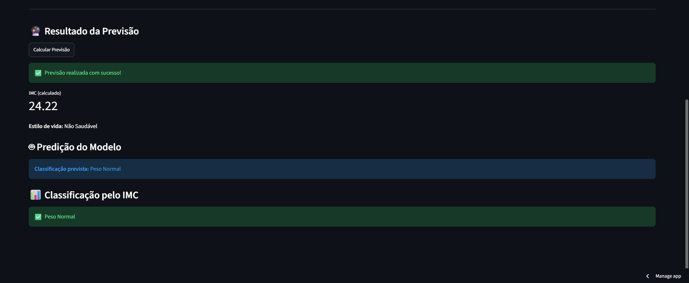

# 📊 Previsão de Obesidade – Streamlit App

Aplicação interativa desenvolvida em **Python** e **Streamlit** que calcula o **IMC** e utiliza **Machine Learning** para estimar o nível de obesidade com base em características relacionadas a hábitos e estilo de vida.

O projeto combina processamento de dados, treinamento de modelo preditivo e disponibilização do modelo em uma aplicação web interativa.

## 🔗 Aplicação online

[**Acessar aplicação no Streamlit**](https://previsao-obesidade-tech.streamlit.app/)

---

## 🎯 Objetivo do Projeto

O objetivo é desenvolver uma aplicação capaz de utilizar dados relacionados ao perfil e aos hábitos do indivíduo para realizar uma **predição do nível de obesidade**, permitindo comparar o resultado do modelo com a classificação tradicional baseada no IMC.

O projeto foi desenvolvido com foco em **análise de dados, Machine Learning e disponibilização de modelos preditivos em uma aplicação interativa**.

---

## ⚙️ Funcionamento

A aplicação permite inserir informações relacionadas ao perfil e ao estilo de vida do usuário e, a partir desses dados:

1. calcula o IMC;
2. processa as informações fornecidas;
3. utiliza o modelo de Machine Learning previamente treinado;
4. estima o nível de obesidade;
5. apresenta os resultados de forma interativa.

---

## 🤖 Machine Learning

O modelo foi treinado a partir do conjunto de dados utilizado no projeto e posteriormente disponibilizado na aplicação por meio de um arquivo de modelo treinado.

O projeto utiliza um fluxo separado entre:

- preparação e exploração dos dados;
- treinamento do modelo;
- salvamento do modelo treinado;
- carregamento do modelo na aplicação;
- realização das previsões a partir dos dados informados pelo usuário.

---

## 📈 Comparação com o IMC

Além da previsão realizada pelo modelo, a aplicação apresenta o **IMC calculado** e permite visualizar a relação entre a classificação tradicional baseada nesse indicador e o resultado obtido pelo modelo.

Essa comparação foi incorporada para facilitar a interpretação dos resultados apresentados pela aplicação.

---

## 🖥️ Interface

A aplicação foi desenvolvida utilizando **Streamlit**, permitindo interação direta com o modelo preditivo por meio de uma interface web.

### Interface da aplicação

### Resultado da previsão

🔗 **[Acessar aplicação no Streamlit](https://previsao-obesidade-tech.streamlit.app/)**

---

## 🛠️ Tecnologias Utilizadas

- **Python**
- **Pandas**
- **Scikit-learn**
- **Streamlit**
- **Joblib**
- **Jupyter Notebook**

---

## 📂 Estrutura do Projeto

├── imagens/
│   ├── interface.png
│   └── resultado.png
├── app.py
├── predictor.py
├── codigo.ipynb
├── modelo_obesidade.pkl
├── Obesity.csv
├── requirements.txt
└── README.md

### Principais arquivos

**`app.py`**  
Interface da aplicação desenvolvida em Streamlit.

**`predictor.py`**  
Responsável pela utilização do modelo para realizar as previsões.

**`modelo_obesidade.pkl`**  
Modelo de Machine Learning treinado e salvo para utilização na aplicação.

**`codigo.ipynb`**  
Notebook utilizado no desenvolvimento e treinamento do modelo.

**`Obesity.csv`**  
Conjunto de dados utilizado no projeto.

**`requirements.txt`**  
Dependências necessárias para execução da aplicação.

**`imagens/`**  
Contém as imagens utilizadas para apresentar a interface e o resultado da aplicação no README.

---

## 📌 Considerações

Este projeto demonstra a aplicação prática de **Machine Learning em uma solução interativa**, desde a utilização do conjunto de dados e treinamento do modelo até sua disponibilização em uma aplicação web utilizando Streamlit.
